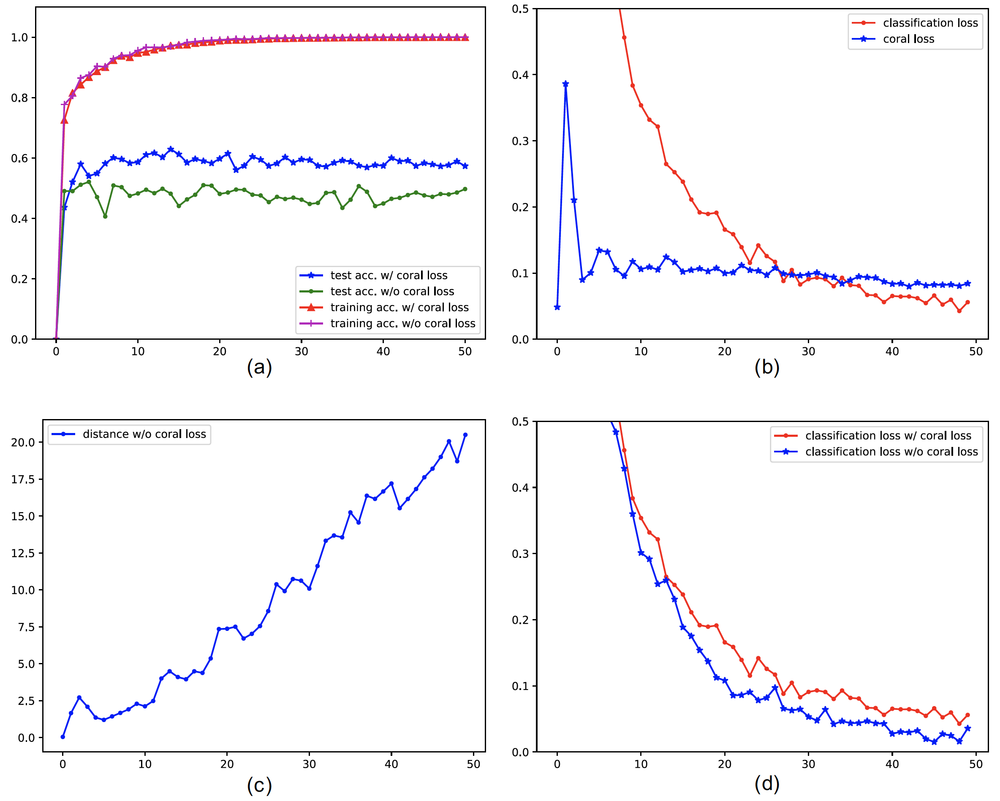

# Deep CORAL Implementation in PyTorch

This is a PyTorch implementation of the Unsupervised Domain Adaptation method proposed in the paper [Deep CORAL: Correlation Alignment for Deep Domain Adaptation. Baochen Sun and Kate Saenko (ECCV 2016)][0].

Deep CORAL aligns the second-order statistics of source and target distributions by minimizing a differentiable loss
function (CORAL loss) that corresponds to the difference between source and target correlations.

The loss is computed batch-wise and minimized jointly with the classification loss. Therefore the training is end-to-end.

This implementation exploits the same hyper-parameter specified in the paper.
The CORAL loss is computed from the scores of the last fully connected layer. 
However, as specified by the authors, it could be can be easily integrated into different layers or network architectures.


### Experimental Results 
The method is evaluated on a standard domain adaptation benchmark: [the Office dataset][1].
The Office dataset contains 31 object categories from an office environment in 3 image domains: Amazon, DSLR, and Webcam.

To provide results comparable to the paper, have been considered:
- Source Domain: *Amazon*  
- Target Domain: *Webcam*



**(a)** CORAL loss significantly improves performances on target domain
 while maintaining almost the same accuracy on source domain.  
**(b)** Classification loss and CORAL loss while optimizing for both domain invariance and class discrimination.  
**(c)** CORAL distance without adaptation  
**(d)** Comparison between adaptation and no adaptation (lambda = 0) classification loss. Without domain adaptation the classification loss decreases slightly faster.


## Training and Evaluation

- Download and extract the [Office dataset][1]

```
wget --load-cookies /tmp/cookies.txt "https://docs.google.com/uc?export=download&confirm=$(wget --quiet --save-cookies /tmp/cookies.txt --keep-session-cookies --no-check-certificate 'https://docs.google.com/uc?export=download&id=0B4IapRTv9pJ1WGZVd1VDMmhwdlE' -O- | sed -rn 's/.*confirm=([0-9A-Za-z_]+).*/\1\n/p')&id=0B4IapRTv9pJ1WGZVd1VDMmhwdlE" -O office31.tar.gz && rm -rf /tmp/cookies.txt
tar -xzf office31.tar.gz
```

- Move the three folders composing the dataset in a new directory "data":
```
mkdir data
mv amazon dslr webcam ./data
```

- Train with default parameters:
```
python train.py
```
After each training epoch, the model will be evaluated on source and target and the respective accuracies printed.
source and target accuracies, classification loss and CORAL loss are saved in `./log.pth`

- Construct plots:
```
python plot_accuracies_losses.py
```


## Acknowledgment


- Official Caffe implementation of Deep CORAL: https://github.com/VisionLearningGroup/CORAL
- Tracker to save and visualize accuracies and losses during training: https://github.com/Cyanogenoid/pytorch-vqa


[0]: https://arxiv.org/abs/1607.01719
[1]: https://people.eecs.berkeley.edu/~jhoffman/domainadapt/#datasets_code


